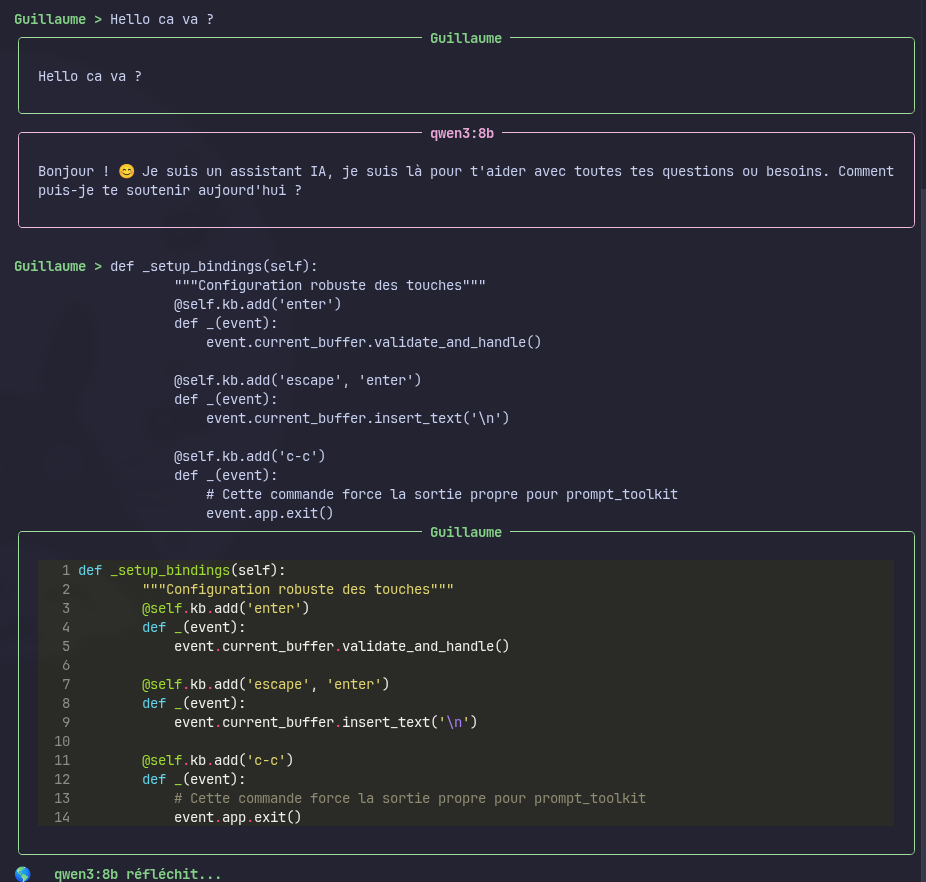

# 🤖 BLABLA AI

**Blabla AI** est un client terminal robuste et élégant pour interagir avec des modèles de langage locaux via **Ollama**.

---

## ✨ Fonctionnalités clés

* **Sélection Intelligente au Démarrage** : Scan automatique de votre serveur Ollama (Mac Mini) et affichage d'une liste numérotée pour choisir votre modèle sans erreur de frappe.
* **Vérification de Santé (Health Check)** : Le script vérifie la connexion au serveur et la disponibilité des modèles avant de lancer la session.
* **Interface Visuelle Double Cadre** : 
    * **Utilisateur (Vert)** : Vos messages s'affichent dans un panneau vert avec détection intelligente de syntaxe (Markdown & Python).
    * **IA (Magenta)** : Les réponses sont rendues en Markdown complet (coloration syntaxique, listes, tableaux).
* **Saisie Multi-ligne Optimisée** :
    * `Entrée` : Envoie votre message instantanément.
    * `Alt + Entrée` : Insère un saut de ligne (idéal pour coller des blocs de code complexes).
* **Architecture** : Code restructuré en classes (OOP) pour une meilleure gestion de la mémoire et une initialisation unique du client Ollama.
* **Gestion des Erreurs & Sortie** : Support complet des commandes `exit`, `quit` et du raccourci `Ctrl+C` pour fermer l'application proprement.

---

## 📸 Aperçu



---

## 🚀 Installation

### 1. Prérequis
Assurez-vous d'avoir **Python 3.10+** et un serveur **Ollama** actif (par défaut sur `http://macmini:11434`).

### 2. Dépendances
Installez les outils nécessaires :
```bash
pip install ollama rich prompt_toolkit pyfiglet
```

### 3. Configuration
Dans le script `main.py`, configurez votre hôte :
```python
HOST = 'http://macmini:11434'
```

---

## 🎮 Commandes Rapides

| Action | Commande |
| :--- | :--- |
| **Envoyer le message** | `Entrée` |
| **Saut de ligne / Code** | `Alt + Entrée` |
| **Quitter proprement** | `Ctrl + C` ou tapez `exit` |

---

## 🛠️ Stack Technique

* **Ollama Python** : Moteur de communication IA.
* **Rich** : Rendu des panneaux (Panel), tableaux (Table) et syntaxe.
* **Prompt Toolkit** : Gestion avancée du clavier et des sessions de saisie.

---