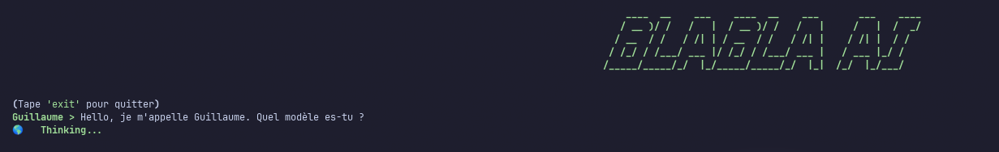
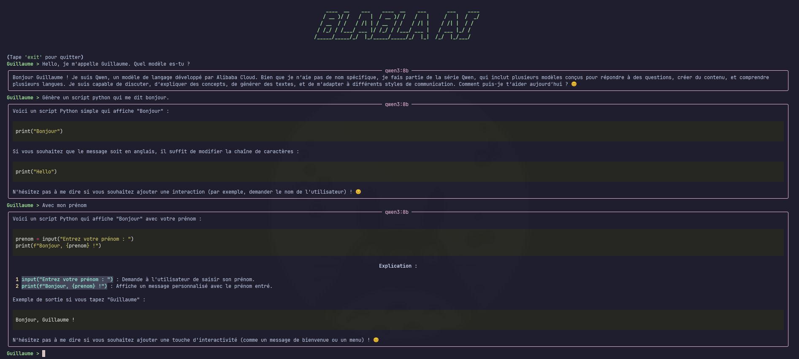

# 🤖 BLABLA AI

> Une interface terminal pour discuter avec ses modèles Ollama locaux.

Je voulais pouvoir requeter mon modèle hébergé sur Ollama en terminal plutot que via openwebui, j'ai donc créer ce petit script en essayant de faire un rendu esthétique.

# 📸 Aperçu

Voici à quoi ressemble l'interface en action :

**1. Une conversation simple et épurée :**

**2. L'interface TUI (Terminal User Interface) complète avec sa barre d'état et le rendu Markdown :**

# 🌟 Points Forts
- **Markdown Ready** : Rendu impeccable des blocs de code et du texte formaté.
- **Contexte Intelligent** : L'IA se souvient de l'historique de la conversation.
- **Barre d'État Live** : Un spinner s'anime en bas de l'écran pendant que le Mac Mini réfléchit.
- **Saisie Robuste** : Utilisation de `prompt_toolkit` pour une édition multi-ligne sans bugs.

## 🛠 Installation Rapide
- **Étape A** : Cloner le dépôt et entrer dans le dossier.
- **Étape B** : Créer un environnement virtuel (`python -m venv .venv`).
- **Étape C** : Installer les outils : `pip install ollama rich pyfiglet prompt_toolkit`.

## 🚀 Lancement
Modifiez l'IP de votre serveur Ollama dans `main.py` et lancez :
`python main.py`